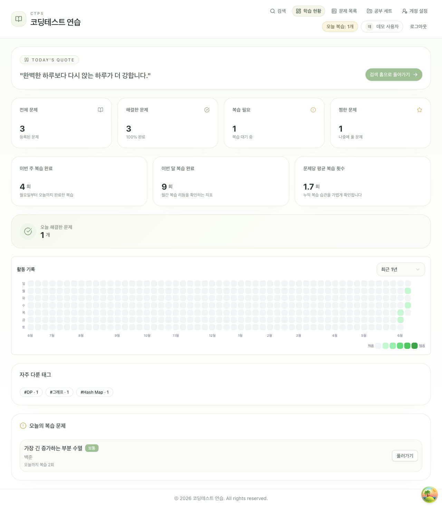
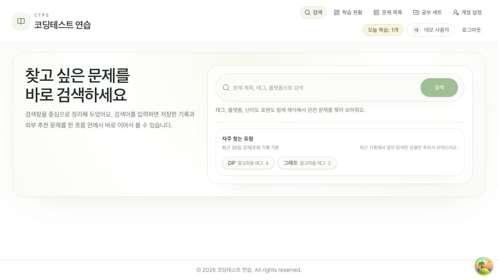
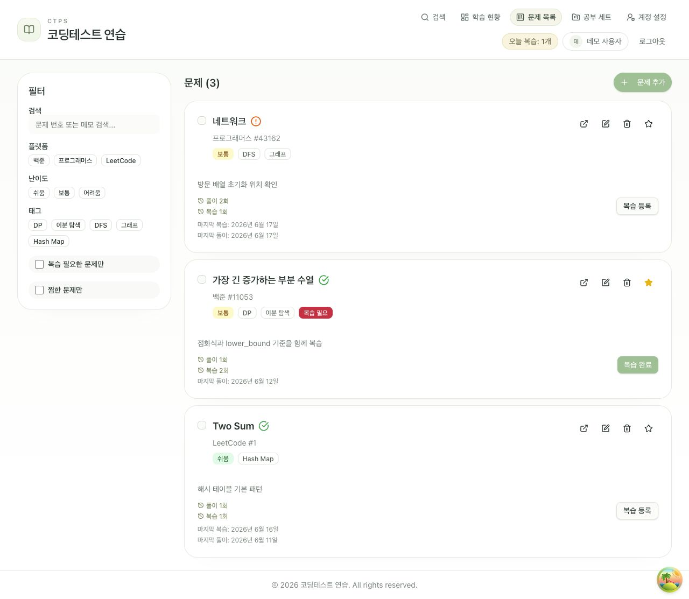
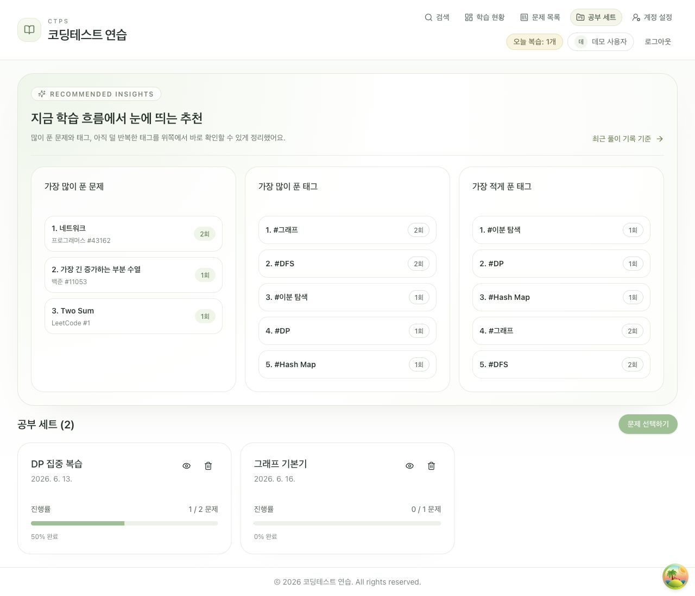
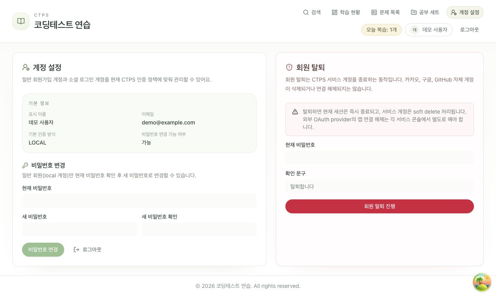

# CTPS Backend
 
여러 코딩테스트 문제 사이트의 검색 결과를 한 화면에서 보되, **일부 사이트가 느리거나 실패해도
검색 자체는 계속 쓸 수 있도록** 만든 학습 플랫폼의 백엔드 API 서버입니다. 외부 의존이 많은
검색에서 "부분 실패를 어떻게 격리할 것인가"를 중심 과제로 잡고 만들었습니다.
 
> 이 README 아래쪽에 실행 방법·인증 구조·배포·환경변수 등 운영 문서가 이어집니다.
 
---
 
## 무엇을 고민했나
 
### 1. 외부 Provider 장애 격리 — 부분 실패를 전체 실패로 만들지 않기
**문제.** 여러 외부 문제 사이트(Provider)를 동시에 검색하는 구조에서, Provider 하나가 느리거나
오류를 내면 통합 검색 전체가 함께 실패했습니다. 외부 서비스는 언제든 느려질 수 있는데, 그때마다
검색 기능 전체가 멈추는 건 운영상 치명적입니다.
 
**설계.** Provider마다 타임아웃을 두고, 성공한 Provider 결과와 실패한 Provider를 분리했습니다.
일부 Provider가 실패해도 성공한 Provider의 결과는 그대로 응답하도록 **부분 성공**으로 처리하고,
성공 결과는 Redis에 캐시해 반복 조회 부담을 줄였습니다.
 
**확인.** 일부 Provider를 실패 상태로 두고도 성공한 Provider 결과가 정상 응답되는지 확인했습니다.
 
### 2. 통합 검색 정렬 — Provider마다 다른 점수 체계 통일
**문제.** 문제 사이트마다 검색 점수와 정렬 기준이 달라서, 원본 점수를 그대로 합치면 특정
Provider 결과만 상위에 몰렸습니다.
 
**설계.** 각 Provider의 점수를 0~1 범위로 정규화한 뒤 통합 점수에 반영하고, URL·제목 기준
중복 제거와 Provider 다양화 규칙을 적용했습니다. 같은 문제가 반복 노출되거나 한 Provider가
상위를 독점하지 않도록 했습니다.
 
### 3. 인증 정보 저장 방식 개선 — 토큰 노출 위험 줄이기
**문제.** 인증 토큰을 LocalStorage에 두면 XSS가 발생했을 때 브라우저 스크립트에 노출될 수
있었습니다.
 
**설계.** 토큰을 HttpOnly·Secure 쿠키로 옮겨 스크립트가 직접 읽지 못하게 하고, CSRF 쿠키 +
`X-CSRF-Token` 헤더 검증과 SameSite 속성을 함께 적용했습니다. 쿠키 정책은 프론트/백엔드
origin과 배포 모드에 따라 계산되도록 구성했습니다.
 
---
 
## 프로젝트에서 신경 쓴 것
 
- **실제 배포 구조**: Vercel(프론트) + Railway(백엔드), Vercel rewrite로 `/api` 프록시
- **DB 마이그레이션**: Flyway 기반, 기존 운영 DB를 Flyway 체계로 옮기는 baseline 전환 문서까지 정리
- **운영 문서 분리**: `docs/`에 기능·아키텍처·트러블슈팅·배포 메모를 나눠 기록
> 데모 화면 캡처는 아래 "연결되는 앱 화면"에 있습니다. (현재 라이브 데모 링크는 제공하지 않습니다.)
 
---

백엔드는 Spring Boot 기반 API 서버이며 세션 인증, 문제 관리, 복습, 통합 검색, 외부 검색 연동을 담당합니다.

## 프로젝트 목적

CTPS 웹 앱의 세션 인증, 문제/복습 도메인, 통합 검색, 외부 검색 연동을 처리하는 API 서버입니다.

## 현재 구현된 기능

- 이메일/비밀번호 기반 인증과 세션 관리
- 카카오, 구글, GitHub OAuth 로그인 처리
- 문제 등록, 수정, 삭제, 메타데이터 조회
- 풀이 이력 조회
- 복습 상태 관리와 복습 이력 처리
- 대시보드 통계 집계
- 내부 문제 + 외부 문제 통합 검색
- 자주 찾는 유형 집계
- Study Set CRUD
- 프로그래머스 카탈로그 수집 및 외부 검색 운영 API 제공

## 연결되는 앱 화면

아래 화면은 이 백엔드 API와 연결되는 CTPS 프론트엔드의 공개용 캡처입니다. 실제 계정이나 운영 데이터가 아닌 더미 데이터만 사용했습니다.

| 로그인 | 비밀번호 재설정 |
| --- | --- |
|  |  |

| 대시보드 | 통합 검색 |
| --- | --- |
|  |  |

| 문제 관리 | Study Set |
| --- | --- |
|  |  |

| 계정 설정 |
| --- |
|  |

## 기술 스택

- Java 17
- Spring Boot 3.3
- Spring MVC
- Spring Data JPA
- Hibernate
- Flyway
- PostgreSQL
- H2 (테스트)

## 프론트엔드와의 연결 구조

기본 연결은 아래 두 형태를 전제로 합니다.

- 로컬 개발:
  - 프론트 `http://localhost:5173`
  - 백엔드 `http://localhost:8080`
- 배포:
  - 프론트는 Vercel
  - 브라우저는 `/api`로 호출
  - Vercel rewrite가 Railway 백엔드로 전달

브라우저 기준 API origin 을 프론트와 같게 맞추는 구성을 권장합니다.
이 경우 쿠키 정책이 더 안정적으로 계산되고, 모바일 브라우저의 서드파티 쿠키 제한 영향을 줄일 수 있습니다.

## 인증 / 세션 / 보안 구조

- 인증 방식: 세션 쿠키 기반
- CSRF 보호: CSRF 쿠키 + `X-CSRF-Token` 헤더
- 대부분의 `/api/**`는 인증 인터셉터 보호 대상
- 로그인, 회원가입, 비밀번호 재설정, OAuth 시작/콜백, 헬스체크는 예외
- 관리자 API는 `/api/admin/**` 별도 보호

쿠키 정책은 `APP_FRONTEND_BASE_URL`, `APP_BACKEND_BASE_URL`, 배포 모드, secure/sameSite 설정을 기준으로 계산됩니다.
운영 시에는 CORS origin 과 cookie sameSite/secure 조합이 가장 중요한 연결 포인트입니다.

## 실행

```bash
cd backend
./gradlew bootRun
```

필수 환경변수는 `src/main/resources/application.properties` 기준으로 주입합니다.

대표 예시:

```bash
DB_URL=jdbc:postgresql://localhost:5432/ctps
DB_USERNAME=your-db-username
DB_PASSWORD=your-db-password
APP_FRONTEND_BASE_URL=http://localhost:5173
APP_CORS_ALLOWED_ORIGINS=http://localhost:5173,http://127.0.0.1:5173
```

배포 권장값:

```bash
APP_FRONTEND_BASE_URL=https://your-frontend-domain.example
APP_BACKEND_BASE_URL=https://your-frontend-domain.example
APP_CORS_ALLOWED_ORIGINS=https://your-frontend-domain.example
APP_CORS_ALLOWED_ORIGIN_PATTERNS=
AUTH_SESSION_SECURE_COOKIE=true
AUTH_SESSION_SAME_SITE=Lax
AUTH_SESSION_COOKIE_DOMAIN=
```

Vercel 이 `/api/*` 를 Railway 로 프록시하는 구조라면 브라우저가 보는 API origin 은 프론트와 동일합니다.
이 경우 `APP_BACKEND_BASE_URL` 도 브라우저가 실제로 보는 public origin 기준으로 맞춰야 쿠키 정책이 `SameSite=Lax` 로 안정적으로 계산됩니다.

## DB 마이그레이션 / Flyway

이 프로젝트는 Flyway를 사용합니다.

- 새로 만드는 빈 DB 환경:
  - `SPRING_FLYWAY_ENABLED=true`
  - `SPRING_JPA_HIBERNATE_DDL_AUTO=validate`
  - 애플리케이션 시작 시 `V1__init.sql`부터 순서대로 마이그레이션이 적용됩니다.

- 이미 운영 중이던 기존 DB 환경:
  - 과거 Hibernate schema auto-update 기반으로 만들어진 DB라면, 일반 마이그레이션처럼 바로 적용하면 안 될 수 있습니다.
  - 이런 경우 현재 스키마를 `V1__init.sql` 기준 baseline 으로 등록한 뒤 이후 버전만 적용해야 합니다.
  - 이 절차는 1회성 운영 전환 작업이므로 상세 순서는 [Flyway Baseline 전환 문서](./docs/FLYWAY_BASELINE_TRANSITION.md)를 확인합니다.

즉, Flyway Baseline 문서는 모든 배포에서 항상 따라야 하는 일반 문서가 아니라, 기존 운영 DB를 Flyway 체계로 옮길 때만 필요한 문서입니다.

## 핵심 환경변수

DB:

- `DB_URL`
- `DB_USERNAME`
- `DB_PASSWORD`

프론트 연결 / 쿠키 / CORS:

- `APP_FRONTEND_BASE_URL`
- `APP_BACKEND_BASE_URL`
- `APP_CORS_ALLOWED_ORIGINS`
- `APP_CORS_ALLOWED_ORIGIN_PATTERNS`
- `AUTH_SESSION_SECURE_COOKIE`
- `AUTH_SESSION_SAME_SITE`
- `AUTH_SESSION_COOKIE_DOMAIN`

OAuth:

- `AUTH_OAUTH_KAKAO_*`
- `AUTH_OAUTH_GOOGLE_*`
- `AUTH_OAUTH_GITHUB_*`

외부 검색 / 운영:

- `PROGRAMMERS_FEED_URL`
- `PROGRAMMERS_IMPORT_DIR`
- `EXTERNAL_SEARCH_*`
- `ADMIN_SECURITY_TOKEN`
- `ADMIN_ALLOWED_IPS`

## 테스트

```bash
./gradlew test
```

## 외부 검색 운영

- 프로그래머스 카탈로그 수집 스크립트: `backend/scripts/`
- 관리자 적재 API: `/api/admin/external-search/programmers/ingest`
- 메트릭 API: `/api/admin/external-search/metrics`

provider 결과는 캐시를 거쳐 수집되며, provider별 score는 정규화 후 통합 검색 점수에 반영됩니다.
일부 provider 실패는 전체 검색 실패로 처리하지 않고 부분 성공으로 다룹니다.

## 문서

- [기능 정리](./docs/features.md)
- [구조 설명](./docs/architecture.md)
- [이슈 / 트러블슈팅](./docs/troubleshooting.md)
- [배포 메모](./docs/deployment.md)
- [Flyway Baseline 전환 문서](./docs/FLYWAY_BASELINE_TRANSITION.md)
